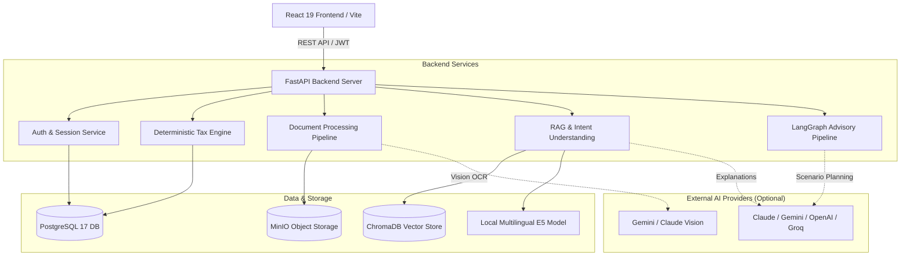

# BAYYAN AI | بيان — Intelligent Jordanian Tax Preparation & Advisory Platform

[](https://github.com/MohammadKhairJaradat/BAYYAN-AI/actions/workflows/ci.yml)
[](https://www.python.org/)
[](https://fastapi.tiangolo.com/)
[](https://react.dev/)
[](https://www.typescriptlang.org/)
[](https://www.postgresql.org/)
[](https://www.trychroma.com/)
[](LICENSE)

**BAYYAN AI (بيان)** is a student graduation project that helps individual taxpayers in Jordan organize tax information, review documents, explore estimates, and receive optional AI-assisted explanations. Tax calculations are performed by deterministic Python code. The included legal knowledge is demo material, and the project does not file official returns or replace professional advice.

---

## 🏛️ Architecture: Deterministic Calculation vs. Language Models

A core design principle of BAYYAN AI is the clear separation between numerical calculation and conversational assistance:

- **Financial calculations are deterministic:** Tax liabilities, exemptions, and deductions are computed in pure Python using fixed-point `Decimal` arithmetic. Language models do not calculate tax figures.
- **Language models assist and explain:** Configured AI providers are used exclusively for semantic document extraction, conversational explanations, and interactive advisory scenarios.

```
┌────────────────────────────────────────────────────────┐
│                   TAXPAYER INTERACTION                 │
└───────────────────────────┬────────────────────────────┘
                            │
            ┌───────────────┴───────────────┐
            ▼                               ▼
  ┌───────────────────┐           ┌───────────────────┐
  │   DETERMINISTIC   │           │    RAG & AI       │
  │    TAX ENGINE     │           │   ASSISTANT       │
  ├───────────────────┤           ├───────────────────┤
  │ • Python Decimal  │           │ • Multilingual E5 │
  │ • Brackets (5-30%)│           │ • Semantic Search │
  │ • Statutory Caps  │           │ • Document Vision │
  │ • Exemptions      │           │ • Advisory Graphs │
  └─────────┬─────────┘           └─────────┬─────────┘
            │                               │
            └───────────────┬───────────────┘
                            ▼
  ┌───────────────────────────────────────────────────┐
  │     TAX ESTIMATE SUMMARY & SCENARIO BREAKDOWN     │
  └───────────────────────────────────────────────────┘
```

### Deterministic Tax Engine (`backend/app/tax_engine/`)
- Implements individual taxpayer rules modeled on Jordanian Income Tax Law No. 34 of 2014 and its amendments under Law No. 38 of 2018.
- Evaluates resident personal exemptions (9,000 JOD), dependent family exemptions (9,000 JOD), allowable invoice-backed deductions (e.g., healthcare, education up to 5,000 JOD), subject to the overall 23,000 JOD statutory ceiling.
- Computes progressive tax brackets (5% up to 30%) with `Decimal` precision.

### Retrieval-Augmented Generation (RAG) & Advisory (`backend/app/rag/`, `backend/app/advisor/`)
- **Semantic Retrieval:** Uses local `intfloat/multilingual-e5-large` (1024-dimensional embeddings) and an embedded **ChromaDB** vector store to index demo legal texts and circulars.
- **Source Review Statuses:** Supports manifest status tags (`demo`, `unreviewed`, `reviewed`) so the retrieval pipeline can differentiate unverified draft material from reviewed demo fixtures.
- **Understanding & Intent Tracking:** Identifies taxpayer context (residency, dependents, deduction categories) to formulate relevant inquiries and guidance.
- **Offline Validation:** Includes offline evaluation harnesses verifying lexical overlap and source isolation without requiring live API calls.
- **Demo Legal Material:** The bundled legal fixtures serve as functional prototypes and test cases; they do not represent an official legal gazette corpus.

---

## 🚀 Key Features

- **🌐 Arabic-First Bilingual Interface:** Designed natively for Arabic (RTL) with full English (LTR) support across dashboards, profiles, and calculation views.
- **📄 Document Vision Extraction:**
  - Automated extraction of expense metadata from receipts and invoices using vision-capable models (e.g., Gemini Flash, Claude Sonnet).
  - **Human-in-the-Loop Review:** Extracted items are presented in a review dialog for taxpayer verification before saving.
  - **Optimistic Concurrency:** Uses profile versioning (`If-Match` headers) returning HTTP 409 Conflict if profile data was modified concurrently, prompting the user to reload the latest state before persisting changes.
- **🤖 Scenario Advisory Workflows:**
  - Multi-step LangGraph workflow exploring potential tax-saving scenarios (e.g., medical and educational deduction ceilings, joint vs. separate spouse options).
  - Generates structured comparisons showing estimated tax impacts across scenarios.
- **💬 Conversational Tax Assistant:**
  - Preserves scoped chat sessions with support for switching between configured AI providers (Gemini, Claude, OpenAI, Groq).
  - Model selection respects tier access rules and accessible keyboard navigation.
- **📊 Usage & Tier Management:**
  - Configurable usage tiers (Basic, Pro, Premium) to track and test monthly quotas for document extractions and chat sessions.
  - Admin management utilities for viewing allowances and inspecting system activity.

---

## 🛠️ Technology Stack

| Layer | Technologies | Description |
|---|---|---|
| **Frontend** | React 19, TypeScript, Vite, Tailwind CSS v4, Lucide Icons | Responsive SPA with RTL/LTR layouts, accessible modals, and interactive tax breakdowns |
| **Backend** | Python 3.14, FastAPI, Uvicorn, Pydantic v2 | Asynchronous REST API with typed schemas and request validation |
| **Database & ORM** | PostgreSQL 17, SQLAlchemy 2.0 (Async), Alembic | Relational data persistence with version-controlled schema migrations |
| **Vector Store** | ChromaDB (In-Process) | Embedded vector store for semantic search and metadata-filtered retrieval |
| **Embeddings** | `intfloat/multilingual-e5-large` | Local 1024-dimensional sentence transformer embeddings |
| **Object Storage** | MinIO (S3-Compatible) | Storage for uploaded tax document images and user avatars |
| **AI Integration** | LangGraph, Google GenAI SDK, Anthropic SDK, OpenAI SDK | Advisory workflows, document vision extraction, and multi-provider chat |
| **Tooling & CI** | `uv`, `npm`, Docker Compose, GitHub Actions | Fast Python dependency management, containerized local services, and automated CI |

---

## 📦 System Architecture



---

## 💻 Quick Start (Windows)

The repository includes a PowerShell launcher that sets up containers, applies database migrations, checks dependencies, and launches the development servers:

```powershell
# Clone the repository
git clone https://github.com/MohammadKhairJaradat/BAYYAN-AI.git
cd BAYYAN-AI

# Launch the full development stack (Docker + Backend + Frontend)
.\start.ps1 -Open
```

- **Frontend:** [http://127.0.0.1:5173](http://127.0.0.1:5173) *(opens in browser with `-Open`)*
- **Backend API & Swagger Docs:** [http://localhost:8000/docs](http://localhost:8000/docs)
- **MinIO Console:** [http://localhost:9001](http://localhost:9001) (`minioadmin` / `minioadmin`)
- **PostgreSQL Database:** `localhost:5432`

To shut down development servers and containers:
```powershell
.\stop.ps1
```

---

## 🐧 Manual / Cross-Platform Setup (Linux & macOS)

### 1. Prerequisites
- Docker & Docker Compose
- Python 3.14+ with [uv](https://docs.astral.sh/uv/)
- Node.js 20+ with npm

### 2. Infrastructure Services
```bash
# Start PostgreSQL and MinIO containers
docker compose up -d --wait
```

### 3. Backend Setup
```bash
cd backend
cp .env.example .env
uv sync --frozen
uv run alembic upgrade head
uv run uvicorn app.main:app --reload --port 8000
```
> Configure any optional AI provider API keys in `backend/.env` as needed.

### 4. Frontend Setup
```bash
cd frontend
cp .env.example .env.local
npm ci
npm run dev
```

---

## 🧪 Testing & Verification

BAYYAN AI includes automated test suites covering calculation logic, API endpoints, schema migrations, and frontend components:

```bash
# Backend test suite (pytest)
cd backend
uv run pytest -q

# Frontend tests, linting, and build validation
cd ../frontend
npm test -- --run
npm run lint
npm run build
```

---

## 📜 Provenance, Attribution & License

- **Academic Project:** BAYYAN AI was conceived and developed as a university graduation project by a student team to assist individual Jordanian taxpayers.
- **Provenance & Attribution:** For details on project history, component attribution, and release candidate inventory, see [docs/provenance.md](docs/provenance.md).
- **Educational Disclaimer:** This application is an educational prototype and demonstration. It does not file tax returns with the Income and Sales Tax Department (ISTD) and does not substitute for certified legal or financial advice.
- **License:** Distributed under the **GNU General Public License v3.0 (GPL-3.0)**. See [LICENSE](LICENSE) for terms.
