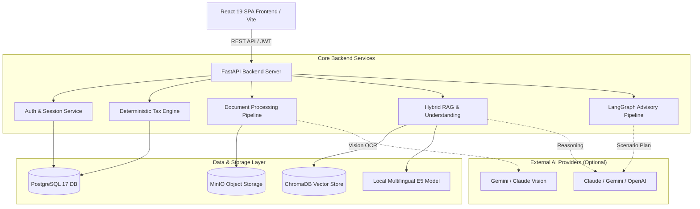

# BAYYAN AI | بيان — Intelligent Jordanian Tax Preparation & Advisory Platform

[](https://github.com/MohammadKhairJaradat/BAYYAN-AI/actions/workflows/ci.yml)
[](https://www.python.org/)
[](https://fastapi.tiangolo.com/)
[](https://react.dev/)
[](https://www.typescriptlang.org/)
[](https://www.postgresql.org/)
[](https://www.trychroma.com/)
[](LICENSE)

**BAYYAN AI (بيان)** is a full-stack, AI-augmented tax preparation and legal advisory platform specifically engineered for **individual Jordanian income taxpayers**. It bridges the gap between complex statutory tax laws and everyday taxpayers through an Arabic-first interface, multimodal document extraction, agentic multi-turn advisory workflows, and a rigorously grounded Retrieval-Augmented Generation (RAG) pipeline.

---

## 🏛️ Core Engineering Philosophy: Deterministic Math vs. Generative AI

A foundational principle of BAYYAN AI is the **strict architectural separation between calculation and explanation**:

> **"Tax calculations must NEVER be performed by Large Language Models. Financial math is deterministic; language models route, extract, and advise."**

```
┌─────────────────────────────────────────────────────────────────────────────────┐
│                                 USER QUERY / INPUT                              │
└────────────────────────────────────────┬────────────────────────────────────────┘
                                         │
                 ┌───────────────────────┴───────────────────────┐
                 ▼                                               ▼
   ┌───────────────────────────┐                   ┌───────────────────────────┐
   │    DETERMINISTIC ENGINE   │                   │    HYBRID RAG & ADVISOR   │
   │      (Pure Python)        │                   │    (LangGraph + E5/LLM)   │
   ├───────────────────────────┤                   ├───────────────────────────┤
   │ • Law No. 34/2014 & 2018  │                   │ • Arabic Intent Analysis  │
   │ • Exact Decimal Math      │                   │ • Multilingual Vector RAG │
   │ • Progressive Brackets    │                   │ • Statutory Grounding     │
   │ • Exemption Rules & Caps  │                   │ • Scenario Simulation     │
   │ • 100% Arithmetic Truth   │                   │ • Human-in-the-Loop Review│
   └─────────────┬─────────────┘                   └─────────────┬─────────────┘
                 │                                               │
                 └───────────────────────┬───────────────────────┘
                                         ▼
   ┌───────────────────────────────────────────────────────────────────────────┐
   │               VERIFIED, AUDITABLE TAXPAYER REPORT & SUMMARY               │
   └───────────────────────────────────────────────────────────────────────────┘
```

1. **Deterministic Tax Engine (`backend/app/tax_engine/`):**
   - Implements the exact statutory logic of the **Jordanian Income Tax Law No. 34 of 2014 and its amendments under Law No. 38 of 2018**.
   - Handles resident personal exemptions (9,000 JOD), dependent family exemptions (9,000 JOD), allowable education/healthcare deductions (up to 5,000 JOD with invoices), and the overarching statutory ceiling of **23,000 JOD** across combined exemptions.
   - Calculates progressive individual tax brackets (5% up to 30%) with exact three-decimal fixed-point precision (`Decimal` arithmetic).
2. **Generative & Retrieval Layer (`backend/app/rag/`, `backend/app/advisor/`):**
   - Natural language intent extraction, semantic search across legal rulings, deduction categorization, and advisory scenario formulation.
   - Zero hallucinated numbers: The AI explains statutory articles and routes options, but queries the deterministic engine for every monetary value.

---

## 🧠 Deep-Dive: Retrieval-Augmented Generation (RAG) Architecture

The RAG pipeline in BAYYAN AI is built from the ground up for high precision in legal and fiscal domains, prioritizing source attribution and verification:

### 1. Semantic Dense Embeddings & Vector Representation
- **Model:** Local `intfloat/multilingual-e5-large` (1024-dimensional embeddings), selected for superior cross-lingual Arabic and English retrieval capabilities without leaking data to external embedding APIs.
- **Asymmetric Prefix Conditioning:** Automatically prepends `passage: ` for indexed statutory texts and `query: ` for user search inquiries, optimizing dense vector alignment according to the E5 architecture.
- **Embedded Vector Store:** Powered by **ChromaDB** with collection metadata encoding model versions, dimensions, and schema versions. Embeddings are stored with SHA-256 source content hashes to guarantee idempotent indexing.

### 2. Statutory Grounding & Multi-Stage Intent Extraction
- **Understanding Layer (`rag/understanding.py`):** Prior to retrieval, incoming conversational turns pass through a structured slot-extraction and contradiction-detection engine. It extracts taxpayer parameters (residency, marital status, dependent count, expense claims) across multi-turn context.
- **Metadata-Constrained Retrieval:** Candidate legal chunks are filtered by authority, statutory year applicability, and verification status (`demo`, `reviewed`, `official_gazette`).
- **Citation Precision:** Every synthesized response includes direct statutory article references, preventing hallucinated legal advice.

### 3. Honest Offline RAG Evaluation Harness (`scripts/evaluate_rag_offline.py`)
Rather than relying on ungrounded LLM-as-a-judge scores, BAYYAN incorporates a dedicated 12-scenario benchmark evaluation set (`docs/knowledge-audit/pit-rag-eval-set.json`):
- **Lexical Overlap & Keyword Validation:** Compares token overlap against ground-truth statutory requirements.
- **Zero-Overlap Honesty Invariant:** Strictly prohibits false positive retrieval verdicts; zero lexical overlap is truthfully flagged as `ZERO_OVERLAP_UNANSWERED` or statutory gap, never as a passing retrieval.
- **Staging Candidate Isolation:** Enforces an automated architectural barrier ensuring unreviewed OCR extracts in `staging/` never leak into the production retrieval manifest.

---

## 🚀 Key Platform Features

- **🌐 Arabic-First, Bilingual Experience:** Built natively for Arabic (RTL) with complete English (LTR) localization across all interactive controls, tax profiles, and charts.
- **📄 Multimodal Document Vision Extraction:**
  - Automated OCR and data extraction from tax deduction receipts, healthcare bills, and educational invoices using Gemini Flash and Claude Sonnet vision models.
  - **Human-in-the-Loop Review Modal:** Extracted suggestions require explicit taxpayer confirmation before persisting to the database. Protected by `If-Match` profile versioning to eliminate 409 stale-state write conflicts and duplicate submissions.
- **🤖 LangGraph Agentic Tax Advisory Workflow:**
  - Multi-node state pipeline exploring tax-saving opportunities (e.g. voluntary social security contributions, medical deduction ceilings, joint vs. separate spouse returns).
  - Produces structured scenario comparisons with visual before-and-after tax liability charts.
- **💬 Context-Aware Chatbot with Model Switching:**
  - Multi-turn conversation history preserved with scoped memory.
  - Interactive model picker supporting multiple AI providers (Gemini, Claude, OpenAI, Groq) with accessible keyboard navigation (WCAG compliant) and tier-based model gating.
- **📊 Tiered Access & Admin Management:**
  - Role-based tier limits (Basic, Pro, Premium) regulating monthly document uploads, extraction quotas, and AI chat sessions.
  - Admin dashboard for monitoring user quotas, resetting monthly allowances, and inspecting system activity.

---

## 🛠️ Technology Stack

| Layer | Technologies | Description |
|---|---|---|
| **Frontend** | React 19, TypeScript, Vite, Tailwind CSS v4, Lucide Icons | Responsive SPA, RTL/LTR design system, accessible modals & interactive tax tables |
| **Backend** | Python 3.14.6, FastAPI, Uvicorn, Pydantic v2 | High-performance asynchronous REST API with typed schema validation |
| **Database & ORM** | PostgreSQL 17, SQLAlchemy 2.0 (Async), Alembic | Transactional relational storage with version-controlled schema migrations |
| **Vector Store** | ChromaDB (In-Process) | Embedded vector search with cosine similarity and metadata filtering |
| **Embeddings** | `intfloat/multilingual-e5-large` | 1024-dimensional local multilingual embeddings via Sentence Transformers |
| **Object Storage** | MinIO (S3-Compatible) | Private storage bucket for tax documents; public-read bucket for user avatars |
| **AI & Orchestration** | LangGraph, Google GenAI SDK, Anthropic Claude SDK, OpenAI SDK | Agentic workflow graph, vision document extraction, and multi-provider chat |
| **Packaging & CI** | `uv`, `npm`, Docker Compose, GitHub Actions | Modern dependency locking, containerized dev stack, and automated test runners |

---

## 📦 System Architecture Diagram



---

## 💻 Quick Start (Windows)

The repository provides a one-command PowerShell launcher that automates Docker containers, database migrations, dependency verification, and server startup:

```powershell
# Clone the repository
git clone https://github.com/MohammadKhairJaradat/BAYYAN-AI.git
cd BAYYAN-AI

# Launch the entire development stack (Docker + Backend + Frontend)
.\start.ps1 -Open
```

- **Frontend:** [http://127.0.0.1:5173](http://127.0.0.1:5173) *(opens automatically in your browser)*
- **Backend API & Swagger Docs:** [http://localhost:8000/docs](http://localhost:8000/docs)
- **MinIO Console:** [http://localhost:9001](http://localhost:9001) (`minioadmin` / `minioadmin`)
- **PostgreSQL Database:** `localhost:5432`

To safely stop all dev servers and containers:
```powershell
.\stop.ps1
```

---

## 🐧 Manual / Cross-Platform Setup (Linux & macOS)

### 1. Prerequisites
- Docker & Docker Compose
- Python 3.14+ with [uv](https://docs.astral.sh/uv/)
- Node.js 20+ with npm

### 2. Infrastructure
```bash
# Start PostgreSQL and MinIO containers
docker compose up -d --wait
```

### 3. Backend Setup
```bash
cd backend
cp .env.example .env
uv sync --frozen
uv run alembic upgrade head
uv run uvicorn app.main:app --reload --port 8000
```

### 4. Frontend Setup
```bash
cd frontend
cp .env.example .env.local
npm ci
npm run dev
```

---

## 🧪 Comprehensive Verification & Testing

BAYYAN AI maintains an extensive test suite covering unit calculations, API contracts, offline RAG validity, and accessibility interactions:

```bash
# Run backend test suite (250+ unit and contract tests)
cd backend
uv run pytest -q

# Run frontend tests, linting, and production build
cd ../frontend
npm test -- --run
npm run lint
npm run build
```

---

## 📜 Provenance, Team Attribution & License

- **Academic Origin:** BAYYAN AI was originally conceived and designed as a university graduation project by a dedicated student team for individual Jordanian taxpayers.
- **Provenance & Source Integrity:** For detailed documentation regarding attribution, legal candidate inventory, and source rights, consult [docs/provenance.md](docs/provenance.md).
- **License:** Distributed under the **GNU General Public License v3.0 (GPL-3.0)**. See [LICENSE](LICENSE) for full details.

---

<p align="center">
  <b>BAYYAN AI (بيان)</b> — Engineered with precision for transparent, reliable individual tax guidance.
</p>
